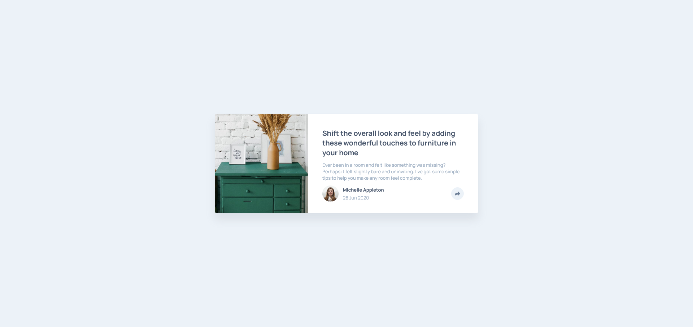

# Frontend Mentor - Article preview component

This is a solution to the [Article preview component](https://www.frontendmentor.io/challenges/article-preview-component-dYBN_pYFT). Frontend Mentor challenges help you improve your coding skills by building realistic projects. 

## Overview

### Screenshot

### The challenge

Users should be able to:

- View the optimal layout depending on their device's screen size
- See hover states for interactive elements

## Author

- Website - [Gökhan 'GhostKozak' Tanrıverdi](https://www.kozak.work)
- Frontend Mentor - [@GhostKozak](https://www.frontendmentor.io/profile/GhostKozak)